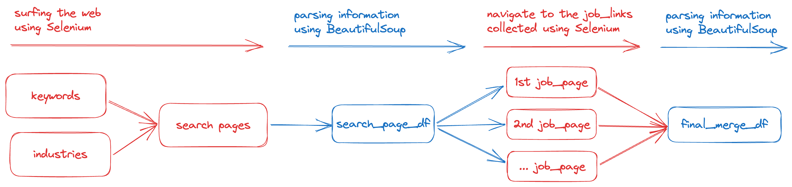
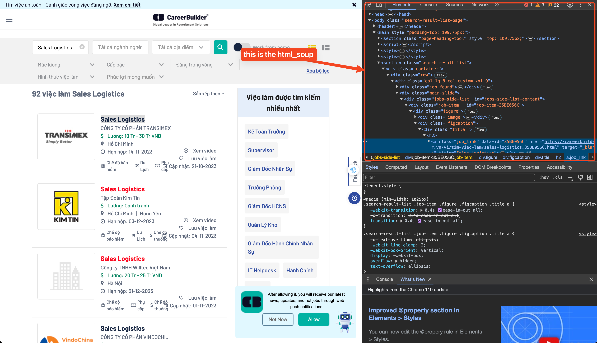
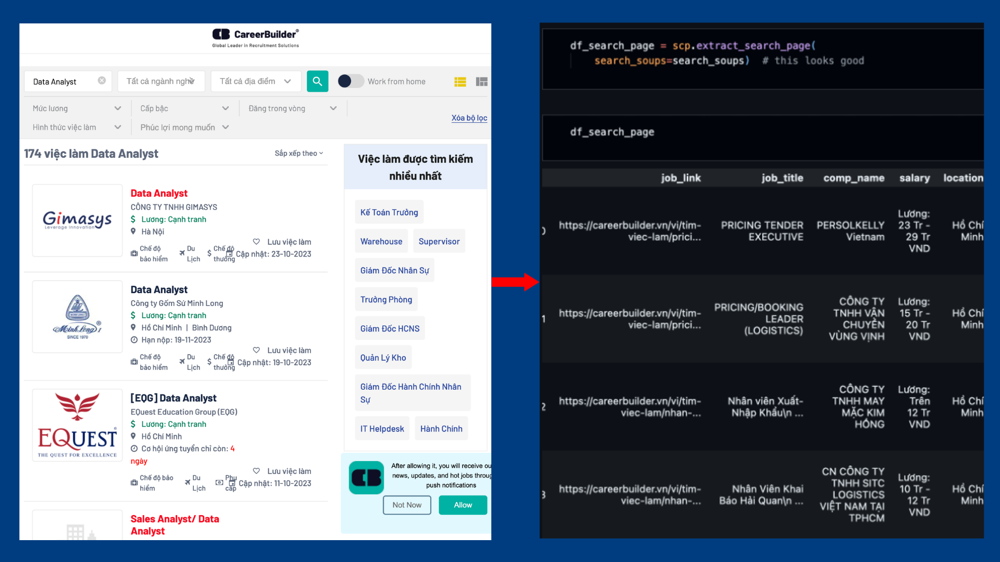
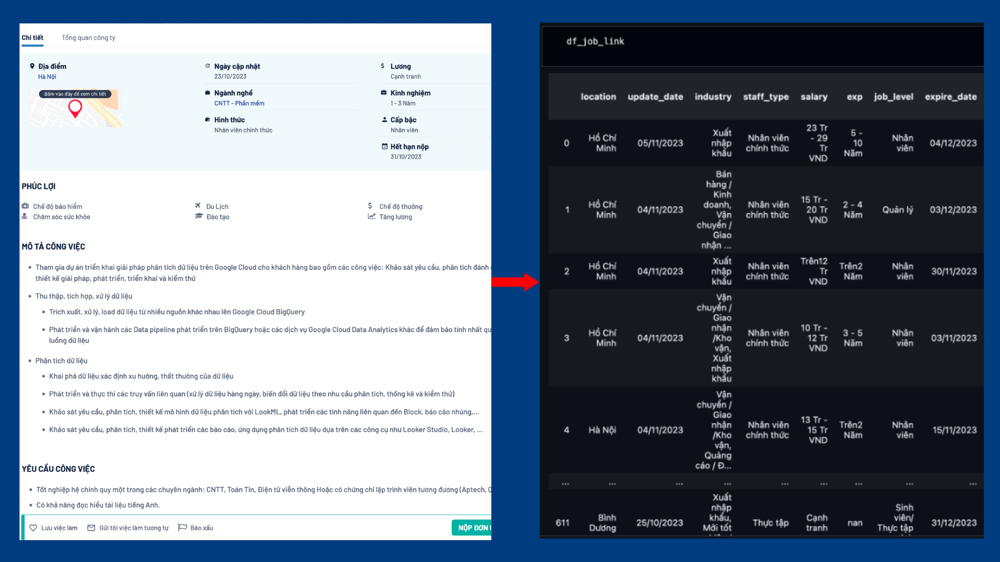

# Overview

This project creates a tool for scraping infomation from job-postings on CareerBuilder, aiming to build a report bi-weekly about the labor market. The report aim to answer these questions.

- What jobs are currently in high demand?
- Are there any direct competitors currently hiring?
- What is the salary norm of the market?

# Workflow

## Techniques

The work-flow of this project is resembled in the [scraper.py](scraper.py) files, which contains these main functions:

1. `get_soup`: Using Selenium to drive the browser.
2. `get_search_soups`: Get the html_soup of the job-searching-page
    
3. `extract_search_page`: Using BeautifulSoup to parse information from the html_soup
    
4. `extract_job_links`: Getting the soup of the job_link pages & parse data from them.
    
5. `merge_search_page_n_job_link`: Merge the df_search_page with df_job_link

## Execution

[scraper.py](scraper.py) is just a source code file, all the execution of this source can be found in [data_collection.py](data_collection.py)

The data collected then being saved as `.csv` files & being cleaned using the [cleaning.py](cleaning.py), after that, users can find the results in [EDA.ipynb](EDA.ipynb )

