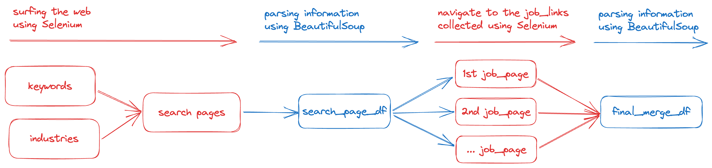

# Overview

This project creates a tool for scraping infomation from job-postings on CareerBuilder, aiming to build a report bi-weekly about the labor market. The report aim to answer these questions.

- What jobs are currently in high demand?
- Are there any direct competitors currently hiring?
- What is the salary norm of the market?

# Workflow

## 1. Collecting

## 2. Analyzing
